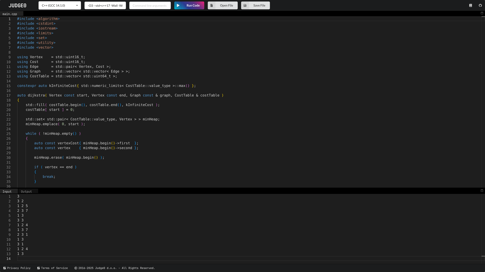

# SocraticAI - AI-Enhanced Judge0 IDE

An enhanced version of Judge0 IDE with AI-powered code assistance, built on top of the original [Judge0 IDE](https://ide.judge0.com).



## Features

- **AI Chat Interface**: Ask questions about your code and get intelligent responses
- **Code-Aware Conversations**: Select code segments and discuss them with the AI
- **Compilation Error Assistance**: Get AI suggestions when your code fails to compile
- **Integrated Experience**: Chat interface seamlessly integrated with the IDE layout

## Prerequisites

- Node.js (v14 or higher)
- npm
- Python (for running the frontend server)
- An OpenRouter API key ([Get one here](https://openrouter.ai/))

## Setup and Running

1. Clone the repository:
   ```bash
   git clone https://github.com/bisman-sodhi/SocraticAI.git
   cd SocraticAI
   ```

2. Install dependencies:
   ```bash
   npm install
   ```

3. Create a `.env` file in the root directory:
   ```env
   OPENROUTER_API_KEY=your_api_key_here
   SITE_URL=http://localhost:8001
   ```

4. Create a `js/config.js` file:
   ```javascript
   const config = {
       OPENROUTER_API_KEY: "your_api_key_here",
       SITE_URL: "http://localhost:8001",
       API_URL: "http://localhost:3000",
       SITE_NAME: "Judge0 IDE"
   };

   export default config;
   ```

5. Start the backend server (handles AI chat):
   ```bash
   npm start
   ```

6. In a new terminal, start the frontend server:
   ```bash
   python -m http.server 8001
   ```

7. Access the IDE at `http://localhost:8001`

> Note: The application requires two servers:
> - Backend server (port 3000): Handles AI chat functionality and API requests
> - Frontend server (port 8001): Serves the IDE interface and static files

## Project Structure

```
├── server.js           # Express server for AI API handling
├── js/
│   ├── ide.js         # Main IDE logic and AI chat integration
│   ├── config.js      # Configuration file (not committed)
│   └── ...           # Other IDE JavaScript files
├── css/
│   ├── ide.css        # IDE and chat interface styling
│   └── ...           # Other style files
└── index.html         # Main HTML file
```

## Development

The project uses:
- Express.js for the backend proxy server
- OpenRouter's Gemini API for AI responses
- Monaco Editor for code editing
- Golden Layout for UI organization

## Security Note

- Never commit your `.env` or `config.js` files
- Both files are listed in `.gitignore`
- Keep your API keys secure

## License

This project is licensed under the MIT License - see the [LICENSE](LICENSE) file for details.

## Acknowledgments

- Based on [Judge0 IDE](https://github.com/judge0/ide)
- Uses [OpenRouter](https://openrouter.ai/) for AI capabilities

# Judge0 IDE
[](https://ide.judge0.com)

[](https://github.com/judge0/ide/blob/master/LICENSE)
[](https://github.com/judge0/ide/releases)
[](https://github.com/judge0/ide/stargazers)

<a href="https://www.producthunt.com/posts/judge0-ide" target="_blank"></a>

## About
[**Judge0 IDE**](https://ide.judge0.com) is a free and open-source online code editor that allows you to write and execute code from a rich set of languages. It's perfect for anybody who just wants to quickly write and run some code without opening a full-featured IDE on their computer. Moreover, it is also useful for teaching and learning or just trying out a new language.

Judge0 IDE is using [**Judge0**](https://ce.judge0.com) for executing the user's source code.

Visit https://ide.judge0.com, and enjoy happy coding. :)

## Community
Do you have a question, feature request, or something else on your mind? Or do you want to follow Judge0 news?

* [Subscribe to Judge0 newsletter](https://subscribe.judge0.com)
* [Join our Discord server](https://discord.gg/GRc3v6n)
* [Watch asciicasts](https://asciinema.org/~hermanzdosilovic)
* [Report an issue](https://github.com/judge0/judge0/issues/new)
* [Contact us](mailto:contact@judge0.com)
* [Schedule an online meeting with us](https://meet.judge0.com)

## Author and Contributors
Judge0 IDE was created by [Herman Zvonimir Došilović](https://github.com/hermanzdosilovic).

Thanks a lot to all [contributors](https://github.com/judge0/ide/graphs/contributors) for their contributions to this project.

## License
Judge0 IDE is licensed under the [MIT License](https://github.com/judge0/ide/blob/master/LICENSE).
